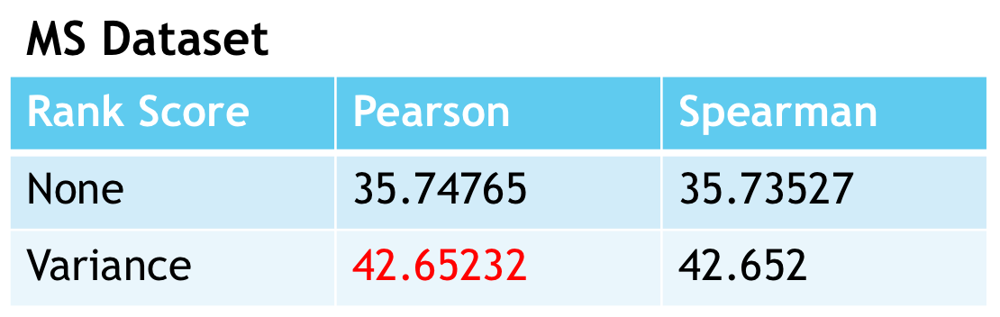
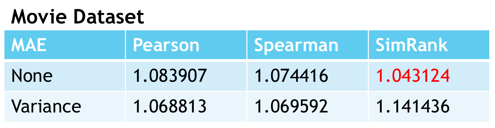

# Project 4: Collaborative Filtering

### [Project Description](doc/project4_desc.md)

Term: Spring 2018

+ Team 5
+ Projec title: Collaborative Filtering
+ Team members
	+ Yuehan Kong (yk2756@columbia.edu)
	+ Wesley Tao
	+ Keran Li (kl2993@columbia.edu)
	+ Jingtian Yao (jy2867@columbia.edu)
	+ Wenyuan Gu (wg2306@columbia.edu)
+ Project summary: In this project, we perform different collaborative filtering algorithms on two datasets: MS dataset and movie dataset. The algorithms include memory-based algorithms (specifying similarity weight, variance weighting and method of selecting neighbours) and model-based algorithms (cluster models). We evaluate and compare a pair of algorithms for collaborative filtering based on MAE and rank score.
	
## Main results
 
  
 
  
**Contribution statement**: 
+ Jingtian Yao and Keran Li: Preprocessed the raw data and implemented the sim rank algorithm.
+ Wenyuan Gu: Was responsible for the cluster model and weighted variance.
+ Yuehan Kong: Implemented the pearson correlation, spearman correlation and selecting neighbors algorithm; built the memory_based.r; wrote the mae and rank score evaluation; wrote the main.rmd; the presenter of this project.

Following [suggestions](http://nicercode.github.io/blog/2013-04-05-projects/) by [RICH FITZJOHN](http://nicercode.github.io/about/#Team) (@richfitz). This folder is orgarnized as follows.

```
proj/
├── lib/
├── data/
├── doc/
├── figs/
└── output/
```

Please see each subfolder for a README file.
